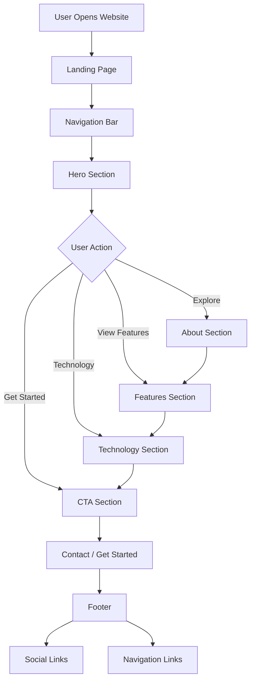
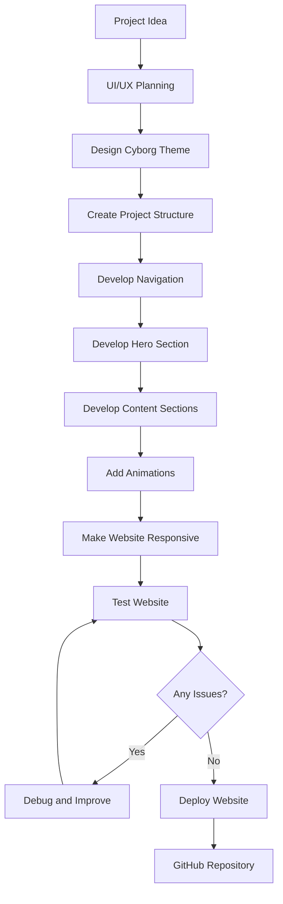
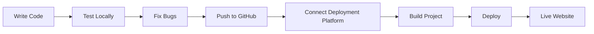

# 🤖 Cyborg-Themed Landing Page

> A futuristic, interactive landing page inspired by **cybernetics, artificial intelligence, robotics, and next-generation technology**.

## 📌 About the Project

The **Cyborg-Themed Landing Page** is a modern, visually immersive web project designed around a futuristic cyberpunk and AI-inspired theme.

The website combines a dark futuristic interface, neon visual effects, smooth animations, responsive layouts, and interactive components to create an engaging digital experience.

The main objective of this project is to demonstrate how modern web development and creative UI/UX design can be combined to build an attractive technology-focused landing page.

---

## 🎯 Project Objectives

* Create a futuristic and visually engaging landing page.
* Design a unique cyborg/cyberpunk-inspired user interface.
* Implement responsive design for desktop, tablet, and mobile devices.
* Add smooth animations and interactive elements.
* Organize information into clear and user-friendly sections.
* Provide an immersive user experience.
* Demonstrate modern frontend development skills.

---

## ✨ Key Features

### 🤖 Futuristic Cyborg Design

* Dark futuristic interface
* Cyberpunk-inspired visual elements
* Neon glow effects
* HUD-style components
* Futuristic typography

### ⚡ Interactive UI

* Animated buttons
* Hover effects
* Interactive cards
* Smooth scrolling
* Section transitions

### 📱 Responsive Design

The website is designed to work across:

* 💻 Desktop
* 💻 Laptop
* 📱 Tablet
* 📱 Mobile

### 🌌 Visual Effects

* Animated backgrounds
* Glowing elements
* Cybernetic visual effects
* Smooth transitions
* Futuristic interface components

---

## 🖥️ Website Sections

### 1. Navigation Bar

Provides quick access to the main sections of the website.

* Home
* About
* Features
* Technology
* Contact
* Call-to-action button

### 2. Hero Section

The hero section introduces the futuristic cyborg concept with:

* Main heading
* Supporting description
* Call-to-action buttons
* Futuristic visual elements
* Animated background

### 3. About Section

Explains the concept behind the project and introduces the connection between:

**Human + Machine + Artificial Intelligence**

### 4. Features Section

Highlights futuristic capabilities such as:

* Artificial Intelligence
* Advanced Robotics
* Neural Technology
* Human-Machine Interaction
* Autonomous Systems

### 5. Technology Section

Showcases the technologies and concepts used in the futuristic ecosystem.

* AI
* Machine Learning
* Robotics
* Neural Networks
* Computer Vision

### 6. Statistics / Highlights

Displays important technology-focused metrics and highlights using visually appealing cards or counters.

### 7. Call-to-Action

Encourages users to explore the project or interact with the platform.

### 8. Footer

Contains:

* Navigation links
* Social links
* Contact information
* Copyright information

---

## 🛠️ Tech Stack

### Frontend

* HTML5
* CSS3
* JavaScript

### Design & UI

* Responsive Web Design
* CSS Animations
* Glassmorphism
* Neon Effects
* Cyberpunk UI
* Futuristic Typography

### Development Tools

* Visual Studio Code
* Git
* GitHub

### Deployment

* Netlify / Vercel / GitHub Pages

> Update the deployment platform above according to where your project is actually hosted.

---

## 📂 Project Structure

```text
cyborg-landing-page/
│
├── index.html
├── style.css
├── script.js
│
├── assets/
│   ├── images/
│   ├── icons/
│   └── fonts/
│
├── README.md
└── LICENSE
```

---

## 🔄 User Flow



---

## 🔧 Development Flow



---

## ⚙️ How It Works

The project follows a single-page landing page architecture.

1. The user opens the website.
2. The browser loads the main landing page.
3. The navigation bar provides access to different sections.
4. The hero section introduces the cyborg concept.
5. The user explores the website through scrolling and navigation.
6. Interactive animations enhance the user experience.
7. Feature sections explain the futuristic capabilities.
8. Technology sections showcase the underlying technologies.
9. The CTA section guides the user toward further interaction.
10. The footer provides additional navigation and social links.

---

## 🎨 UI/UX Design

The visual design follows a combination of:

**Cyberpunk + Artificial Intelligence + Robotics + HUD + Glassmorphism**

### Recommended Color Palette

| Element    | Color              |
| ---------- | ------------------ |
| Background | Black / Dark Navy  |
| Primary    | Neon Cyan          |
| Secondary  | Electric Purple    |
| Accent     | Neon Green         |
| Text       | White / Light Gray |

The overall design focuses on high contrast, glowing elements, futuristic typography, and clean layouts.

---

## 🧪 Testing

The website should be tested for:

* Navigation functionality
* Button functionality
* Responsive layouts
* Mobile compatibility
* Animation performance
* Image loading
* Browser compatibility
* Accessibility
* Broken links

### Supported Browsers

* Google Chrome
* Microsoft Edge
* Mozilla Firefox
* Safari

---

## 🚀 Deployment Flow



---

## 🔮 Future Enhancements

Future versions of this project can include:

* 🤖 AI-powered chatbot
* 🎙️ Voice-controlled interface
* 🧠 AI recommendation system
* 👁️ Computer vision integration
* 🦾 Interactive 3D cyborg model
* 🌐 Three.js / WebGL environment
* 🔐 Cybersecurity dashboard
* ⚡ Real-time system monitoring
* 🎮 Advanced interactive animations
* 🌌 3D futuristic environment

---

## 📸 Screenshots

Add screenshots of your website here.

```text
screenshots/
├── home.png
├── about.png
├── features.png
└── mobile.png
```

Example:

```markdown


```

---

## 🌐 Live Demo

🔗 **Live Website:**
`YOUR_LIVE_WEBSITE_LINK`

🔗 **GitHub Repository:**
`YOUR_GITHUB_REPOSITORY_LINK`

---

## 👩‍💻 Author

**A. Veda Sri Kavya**

B.Tech — Artificial Intelligence & Machine Learning

### Connect With Me

* GitHub: `YOUR_GITHUB_LINK`
* LinkedIn: `YOUR_LINKEDIN_LINK`

---

## 📄 License

This project is created for educational, portfolio, and demonstration purposes.

---

## ⭐ Acknowledgement

This project was developed as a frontend web development project focused on **futuristic UI/UX, responsive design, animations, and creative web development**.

If you like this project, consider giving it a ⭐ on GitHub!

---

### 🚀 Project Summary

**Cyborg-Themed Landing Page** demonstrates the combination of:

> **Creative Design + Modern Web Development + Futuristic UI + Interactive Experience**

It serves as a foundation for future projects involving **AI, robotics, cybernetics, and next-generation digital interfaces**.


    


    
